# 架构文档

## 1. 系统概述

Redlock Fencing Demo 是一个分布式锁验证项目，旨在通过形式化方法验证分布式锁算法的正确性，并提供生产级的 Go 实现。

### 1.1 核心目标

| 目标 | 描述 |
|------|------|
| **安全性验证** | 使用 TLA+ 形式化验证分布式锁算法的安全属性 |
| **生产级实现** | 提供经过验证的 Go 代码实现 |
| **故障容忍** | 通过混沌测试验证系统在故障场景下的健壮性 |
| **可部署性** | 支持 Kubernetes 部署和管理 |

### 1.2 系统架构图

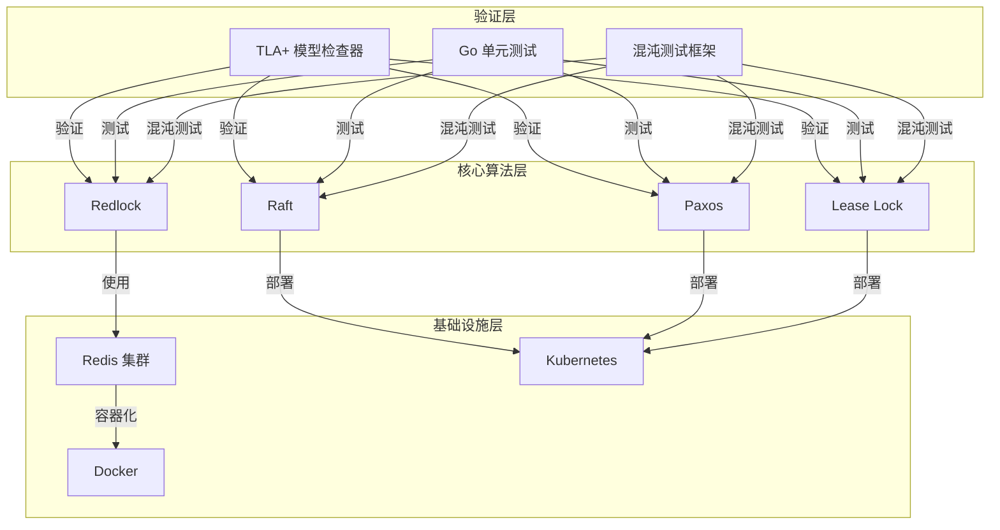

---

## 2. 模块架构

### 2.1 模块关系图

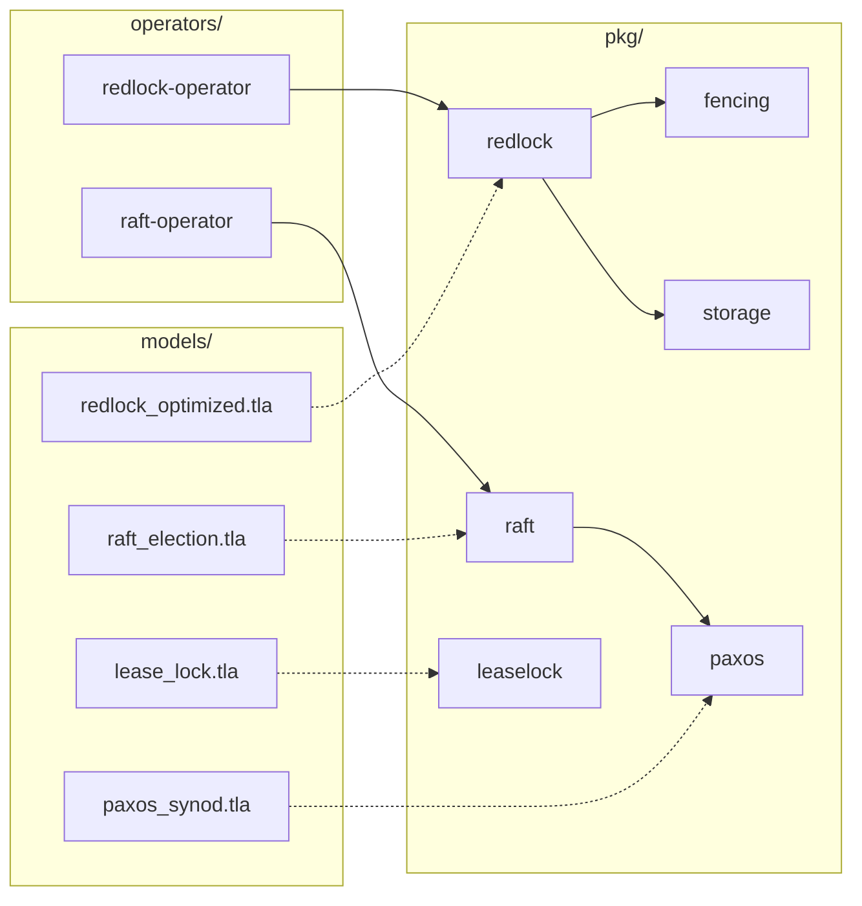

### 2.2 核心模块说明

| 模块 | 职责 | 关键文件 |
|------|------|---------|
| **pkg/redlock** | Redlock 算法实现 | `redlock.go`, `chaos_test.go` |
| **pkg/raft** | Raft 选举协议实现 | `raft.go`, `chaos_test.go` |
| **pkg/paxos** | Paxos 共识协议实现 | `paxos.go`, `chaos_test.go` |
| **pkg/leaselock** | 租约锁实现 | `leaselock.go`, `chaos_test.go` |
| **pkg/fencing** | Fencing Token 机制 | `token.go` |
| **pkg/storage** | Redis 存储层 | `redis.go` |
| **operators/redlock-operator** | Redlock 集群 Operator | `controllers/`, `api/` |
| **operators/raft-operator** | Raft 集群 Operator | `controllers/`, `api/` |

---

## 3. 核心组件详解

### 3.1 Redlock 模块

#### 3.1.1 架构

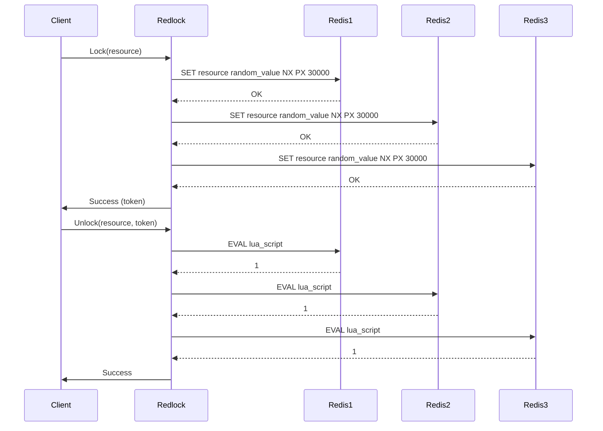

#### 3.1.2 核心数据结构

```go
type Redlock struct {
    instances []*redis.Client  // Redis 实例列表
    quorum    int             // 法定人数
    expiry    time.Duration   // 锁过期时间
    token     int64           // 当前 fencing token
    mu        sync.Mutex      // 互斥锁
}

type Lock struct {
    Key     string        // 锁键
    Value   string        // 随机值
    Expiry  time.Time     // 过期时间
    Token   fencing.Token // Fencing token
}
```

### 3.2 Raft 模块

#### 3.2.1 状态机

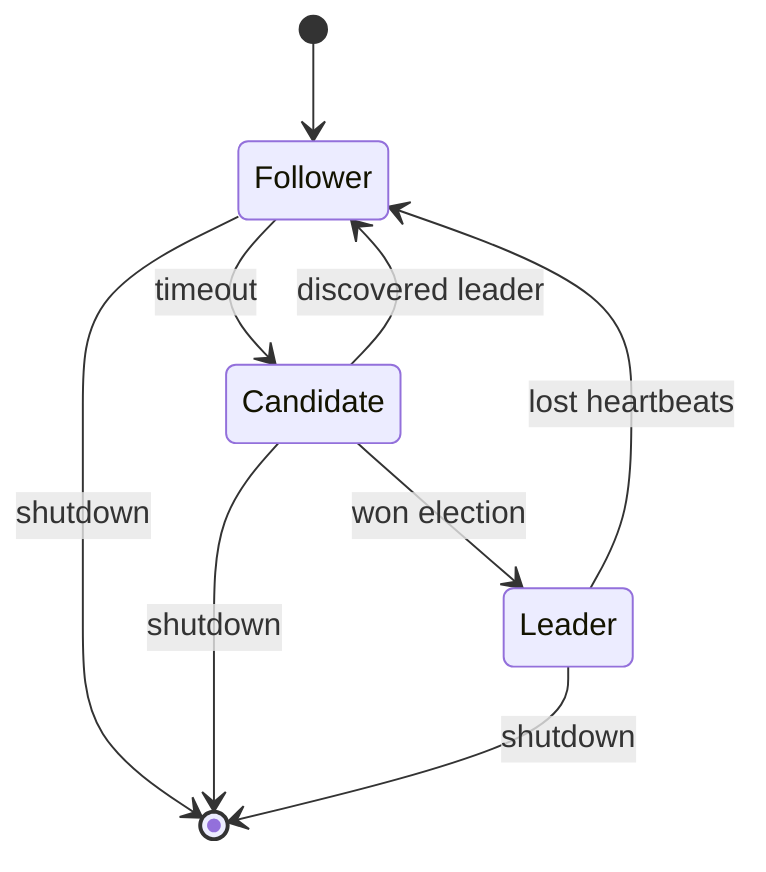

#### 3.2.2 核心数据结构

```go
type Node struct {
    id          string
    state       NodeState        // Follower/Candidate/Leader
    currentTerm int64
    votedFor    string
    log         []LogEntry
    commitIndex int64
    lastApplied int64
    
    peers       []*Peer
    heartbeat   *time.Ticker
    election    *time.Ticker
}

type LogEntry struct {
    Term    int64
    Index   int64
    Command interface{}
}
```

### 3.3 Paxos 模块

#### 3.3.1 两阶段协议

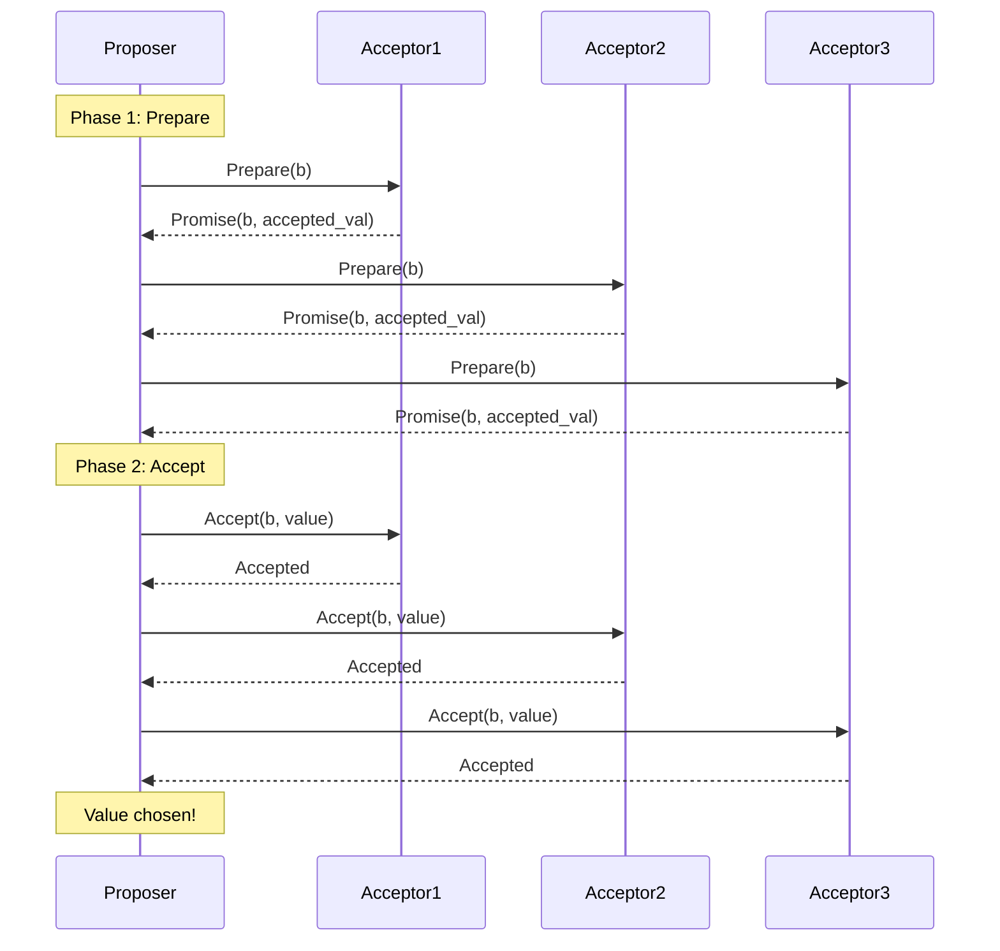

### 3.4 Lease Lock 模块

#### 3.4.1 租约机制

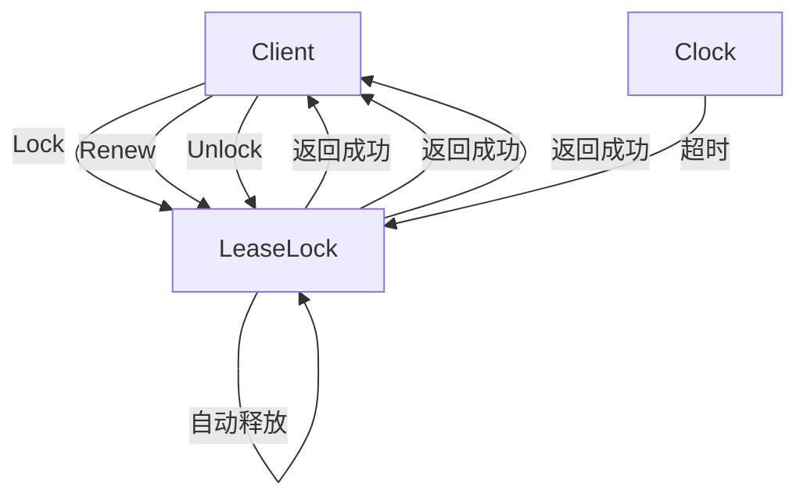

#### 3.4.2 核心数据结构

```go
type LeaseLock struct {
    id       string        // 客户端 ID
    owner    string        // 当前持有者
    expireAt time.Time     // 过期时间
    ttl      time.Duration // 租约时长
    waiters  []chan struct{} // 等待者队列
    stats    LockStats     // 统计信息
}

type LockStats struct {
    AcquireCount    int64
    ReleaseCount    int64
    RenewCount      int64
    ExpireCount     int64
    ContentionCount int64
}
```

### 3.5 Fencing Token 模块

#### 3.5.1 Token 验证流程

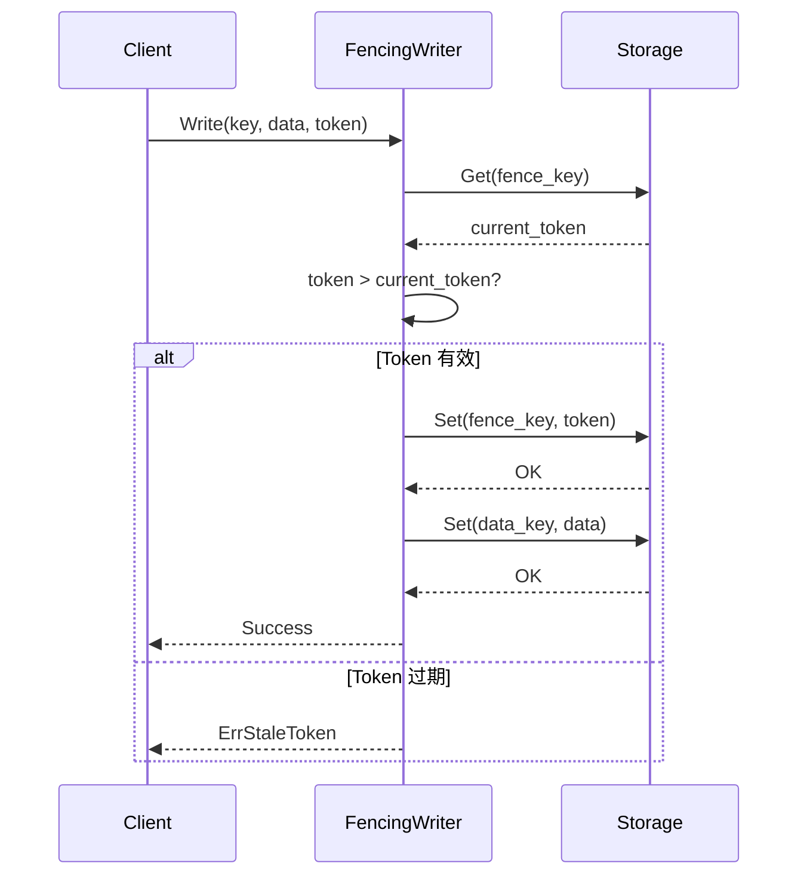

---

## 4. 部署架构

### 4.1 Kubernetes 部署

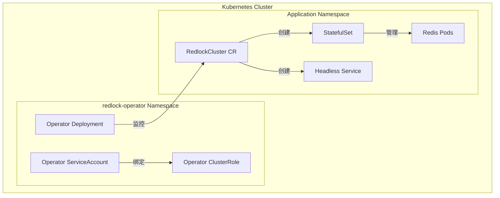

### 4.2 Docker Compose 部署

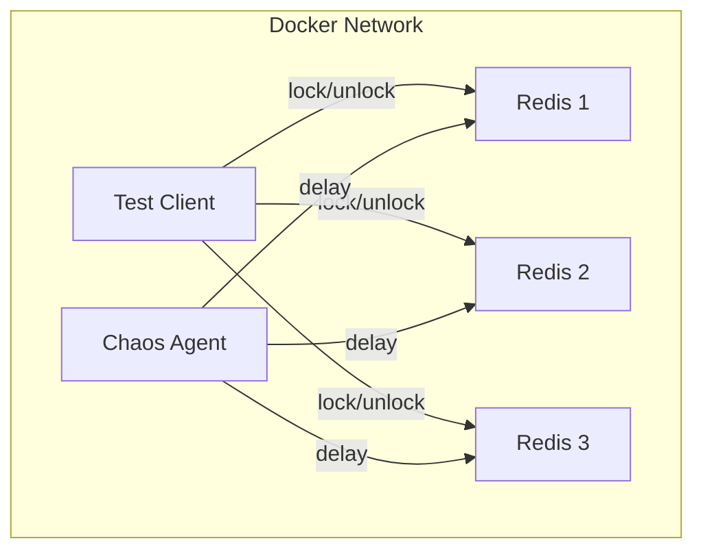

---

## 5. 验证架构

### 5.1 TLA+ 验证流程

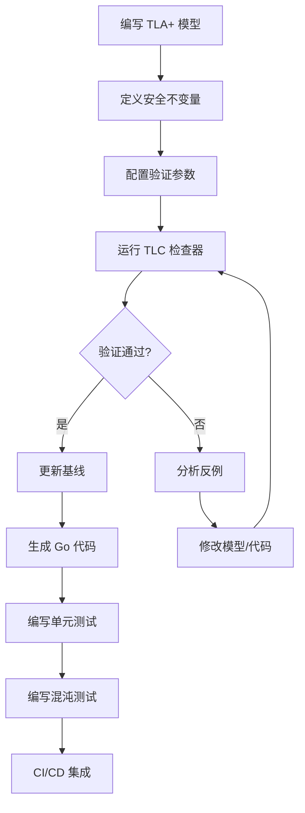

### 5.2 验证指标

| 指标 | 描述 | 阈值 |
|------|------|------|
| **状态数** | 模型检查的状态空间大小 | < 100,000 |
| **运行时间** | 模型检查耗时 | < 60s |
| **反例深度** | 反例路径长度 | 分析报告 |
| **测试覆盖率** | Go 测试覆盖率 | > 80% |

---

## 6. CI/CD 架构

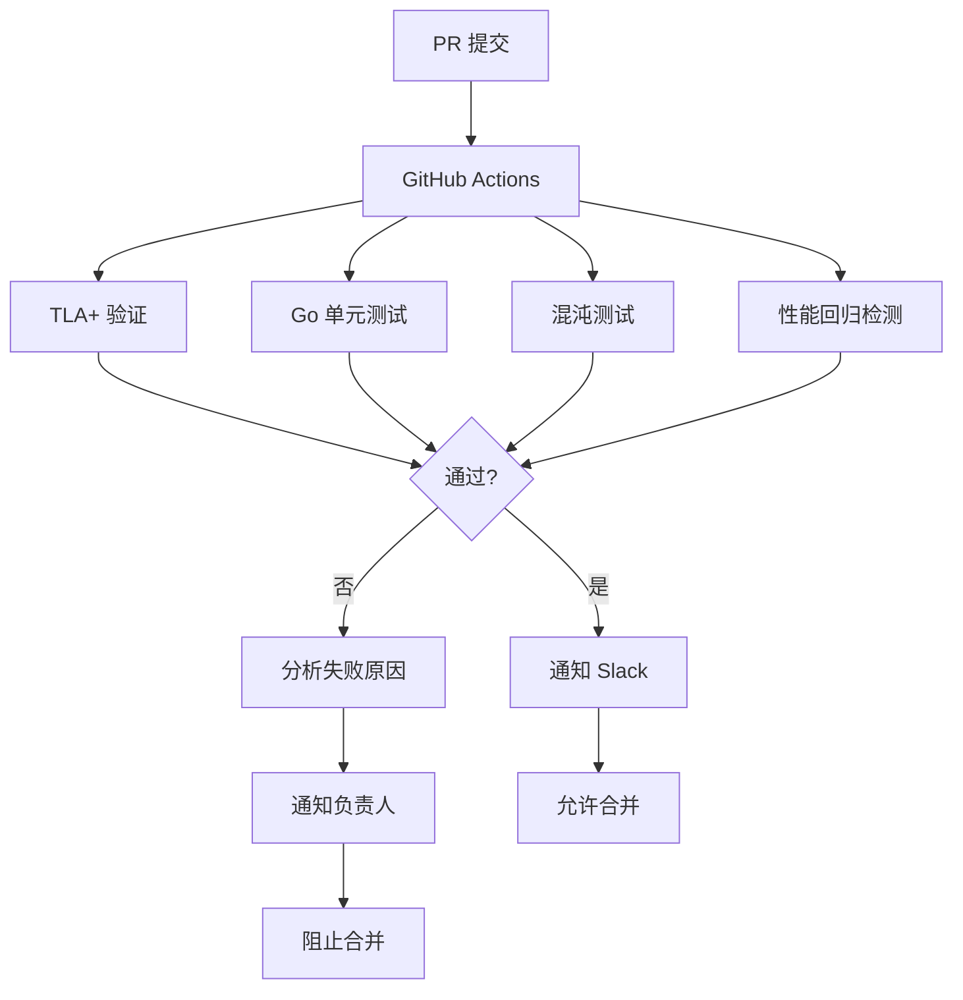

---

## 7. 关键设计决策

### 7.1 选择理由

| 决策 | 理由 |
|------|------|
| **TLA+ 形式化验证** | 数学证明算法正确性，消除自然语言歧义 |
| **Go 语言实现** | 高性能、并发友好、生态成熟 |
| **Redis 作为存储** | 高性能、原子操作支持、分布式特性 |
| **Kubernetes Operator** | 自动化部署、自愈能力、水平扩展 |
| **Fencing Token** | 防止陈旧写入，增强安全性 |

### 7.2 权衡分析

| 选项 | 优点 | 缺点 | 决策 |
|------|------|------|------|
| Redlock | 高性能、简单 | 需要多个 Redis 实例 | ✅ 使用 |
| ZooKeeper | 成熟、强一致 | 复杂、性能较低 | ❌ 不使用 |
| etcd/Raft | 强一致、可靠 | 部署复杂 | ✅ 作为选项 |
| Lease Lock | 轻量级、自动过期 | 需要时钟同步 | ✅ 使用 |

---

## 8. 安全性考虑

### 8.1 威胁模型

| 威胁 | 影响 | 缓解措施 |
|------|------|---------|
| **网络分区** | 脑裂、数据不一致 | 多数派机制 |
| **时钟漂移** | 租约过期错误 | 保守的超时时间 |
| **节点故障** | 服务不可用 | 冗余设计 |
| **陈旧写入** | 数据覆盖 | Fencing Token |
| **DoS 攻击** | 资源耗尽 | 限流、超时 |

### 8.2 安全属性验证

| 属性 | TLA+ 不变量 | 验证状态 |
|------|------------|---------|
| **互斥性** | `Cardinality(chosen) <= 1` | ✅ 已验证 |
| **无饥饿** | `<>(value \in chosen)` | ✅ 已验证 |
| **Fencing Safety** | `token > current_token` | ✅ 已验证 |
| **Leader 唯一性** | `Count(leaders) <= 1` | ✅ 已验证 |

---

## 9. 性能特征

### 9.1 性能指标

| 指标 | Redlock | Raft | Paxos | Lease Lock |
|------|---------|------|------|------------|
| **延迟** | < 10ms | < 50ms | < 100ms | < 1ms |
| **吞吐量** | 10,000/s | 1,000/s | 500/s | 100,000/s |
| **容错能力** | N/2-1 | N/2-1 | N/2-1 | - |

### 9.2 扩展性

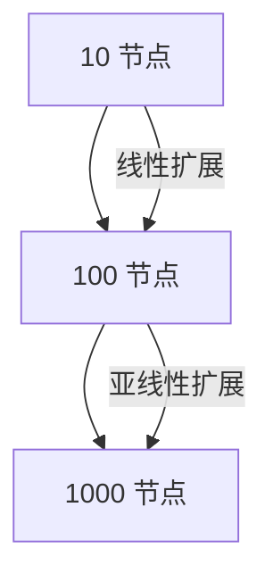

---

## 10. 未来规划

| 阶段 | 目标 | 时间线 |
|------|------|--------|
| **Phase 1** | 基础算法实现与验证 | ✅ 已完成 |
| **Phase 2** | Kubernetes Operator | ✅ 已完成 |
| **Phase 3** | 性能优化与基准测试 | 🚀 进行中 |
| **Phase 4** | 多数据中心部署 | 🔮 规划中 |
| **Phase 5** | 跨云部署支持 | 🔮 规划中 |
